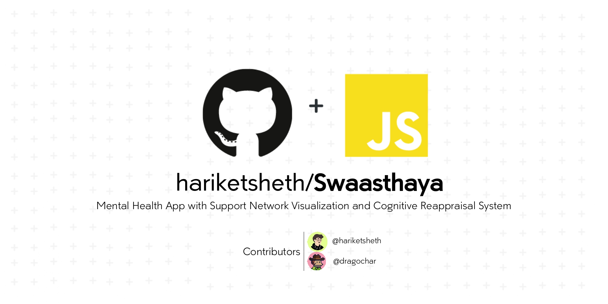

# Swaasthaya


<div align="center">
	<strong>Mental Health App with Support Network Visualization and Cognitive Reappraisal System </strong>
</div>


<br>

[](https://swaasthaya-16620.web.app/)
[](https://devpost.com/software/swaasthaya)


<br><br>

## 💡 Inspiration
> _"There is hope, even when your brain cells tell there isn't"_ <br>
> _"You don't have to be great to start, but you should start to be great"_

- These two quotes along with the exponential rise in the Mental Health, anxiety, depression cases (even `Post COVID`) - our team [[Hariket](https://github.com/hariketsheth), [Zac](https://github.com/dragochar)] decided to work on a Mental Health App that does give users options to track their day-to-day activities. 
- Online technologies have a lot of potential for expanding therapeutic intervention delivery methods to assist people cope with increasingly widespread mental diseases like anxiety and depression. 
- `Cognitive reappraisal`, for example, is a technique that entails altering one's viewpoint on unpleasant ideas in order to enhance one's emotional state.
- The mental health of `at risk` populations, including those with pre-existing mental health disorders, has also been raised as a cause for worry even after the pandemic. 
- Apps can help patients gain autonomy, provide an undisrupted sequence of contacts over time, demonstrate evidence-based benefits for patients with ranges from mild and mild to moderate symptoms, are easy to use, can be used to coordinate services and information within an episode of care, and are generally cost-effective.
- At some point in their lives, more than half of people will be diagnosed with a mental disease or problem.
	- `1 in 5 Americans` live with a mental health condition.
		- This means that either you or someone you know has been impacted.
	- `1 in every 20 Americans` is living with a serious mental health condition like schizophrenia, bipolar disorder, or long-term recurring major depression.
	- 50% of all lifetime `mental illness begins by age 14`, and `75% by age 24.`

<br>

## 💻 What it does
Swaasthaya (meaning: Health in Hindi [India]) is a web application that can:
- Be used a Habit Tracker in a gamified manner
- Users earn points based on the completion of certain habits they have added
- A streak is maintained for each habit separately. A proper analysis is carried out
- The analysis conducted is not only important for making judgements at the backend but is also shown to the user. 
- Based on the XP(Points) and level, the Users are rewarded with different assets, with which they can design their own garden

<br>

## ⚙️ How we built it
- Figma: For Designing and Prototyping
- React JS: For Frontend
- CSS: For Styling
- Firebase: For Database 
- IEEE Xplore and Springer: For Research and Facts on Mental Health

<br>

## 🌳 Integration 
- Created this based off of this Holaplex open source repo: https://github.com/holaplex/Solana-TPS-Discord-Bot
- Need to run the backend off of your local machine. 
- To do that, follow the instructions in this repo: https://github.com/dragochar/swaasthaya-solana-tps-backend
- This adds the functionality to show the current Solana TPS on the Daily Habits page, and advice the user to focus on their mental health if the Solana TPS is too slow.

<br>

## 🤝 Use of GitHub
We are using GitHub for the following reasons:

1. **`Collaboration:`** GitHub makes it easy to share code with others and helps a lot in collaboration.
2. **`Agile Kanban Board:`** We also used GitHub for planning and keeping track of our project and its progress with the help of the GitHub project management tool.
3. **`Implementing the workflow:`** GitHub makes it easy to implement the workflows and makes the version control quite easy and reliable.
4. **`Open Source project:`** Deploying the project on GitHub helped us to get the project deployed on the network to be accessed by other people.
5. **`Using PRs and Issues:`** We are doing multiple PRs and building multiple Issues to keep on track of the project.
6. **`Implementing the CI/CD workflow:`** GitHub makes it easy to implement the CI/CD workflow and makes the deployment process easy.

<br>

## 🧠 Challenges we ran into
- Due to the difference in the time zones and works, it was a bit difficult to fix a common time and collaborate but we managed to get the project done in time.
- None of the teammates were much acquainted with usage of Holaplex and how to incorporate it in the idea, we had to do research while working on the project.

<br>

## 🏅 Accomplishments that we're proud of
- Completing the project in the given time frame.
- Implementing the Brainstormed idea, deploying it successfully and integrating it.

<br>

## 📖 What we learned
- Collaboration with other developers.
- How to work with Holaplex, Web3, NFTs. Had a great learning experience

<br>

## 🚀 What's next for Swaasthaya
1. `Visualizing Support Networks`- We are going to implement the idea as a mental health community forum, where patients post their problems. The support extended by community volunteers and messages sent by them is visualized as a growing forest, each tree representing a supporter. 
2. `Meditation Room`- We are going to provide a virtual meditation room where individuals can select soothing sound tracks from a collection of tracks including sounds of nature including rain, wind, flowing river, rustling of forest, Tibetan flute etc. Users can choose a combination of tracks and control volume of each track to create a custom environment by simultaneously playing them, creating an immersive experience  during meditation sessions.
3. `Semantic and Mood Analysis`- We would conducting an analysis and based on the Analysis, users would be given certain advantages and the project efficiency would increase because including this would enhance our project

<br>

## 🌟 Steps to Get Started
```bash
# Clone the repo
git clone https://github.com/hariketsheth/swaasthaya

# Change the directory
cd swaasthaya

# Install the dependencies

npm install
#or
yarn

# Run the app

npm start
# or
yarn start
```

<br><br>


[](https://www.youtube.com/watch?v=R39gbAesCSU)
